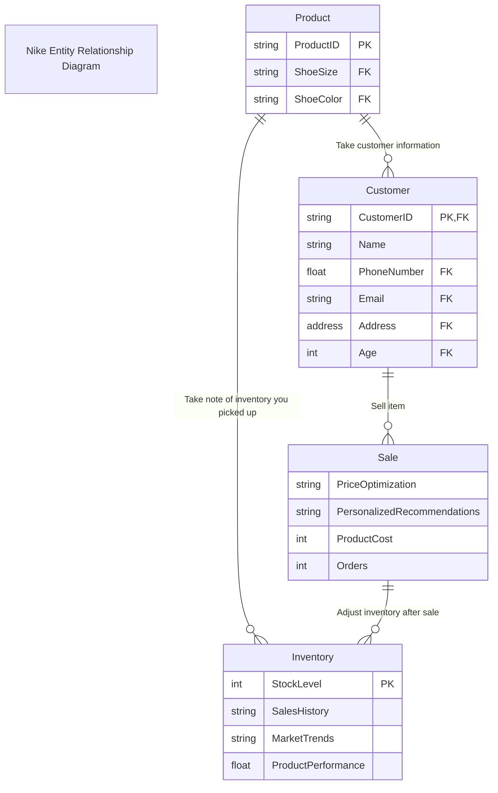

```mermaid

erDiagram

"Nike Entity Relationship Diagram"

    Product ||--o{ Customer :"Take customer information"
    Product ||--o{ Inventory :"Take note of inventory you picked up"
    Product{
        string ProductID PK
        string ShoeSize FK
        string ShoeColor FK
    }
    
    Customer ||--o{ Sale :"Sell item"
    Customer{
        string CustomerID PK, FK
        string Name
        float PhoneNumber FK
        string Email FK
        address Address FK
        int Age FK
    }
    
    Sale ||--o{ Inventory :"Adjust inventory after sale"
    Sale{
        string PriceOptimization
        string PersonalizedRecommendations
        int ProductCost
        int Orders
    }
    
    Inventory{
        int StockLevel PK
        string SalesHistory 
        string MarketTrends
        float ProductPerformance
    }

```