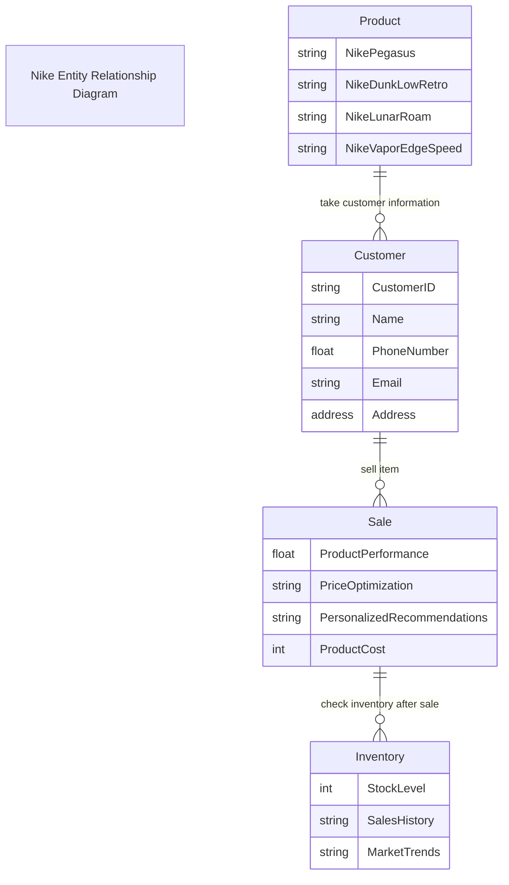

```mermaid

erDiagram

"Nike Entity Relationship Diagram"

    Product ||--o{ Customer :"take customer information"
    Product{
        string NikePegasus
        string NikeDunkLowRetro
        string NikeLunarRoam
        string NikeVaporEdgeSpeed
    }
    
    Customer ||--o{ Sale :"sell item"
    Customer{
        string CustomerID
        string Name
        float PhoneNumber
        string Email
        address Address
    }
    
    Sale ||--o{ Inventory :"check inventory after sale"
    Sale{
        float ProductPerformance
        string PriceOptimization
        string PersonalizedRecommendations
        int ProductCost
    }
    
    Inventory{
        int StockLevel
        string SalesHistory
        string MarketTrends
    }

```