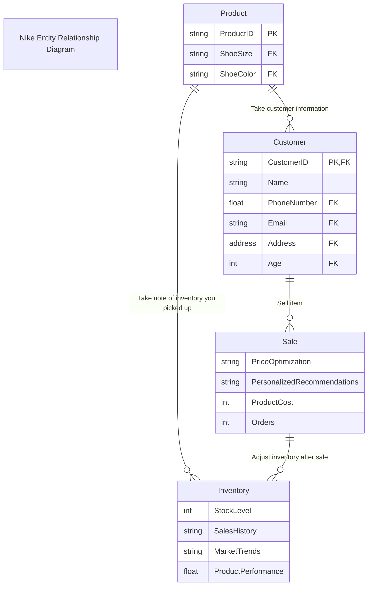

### Documentation

This is a graphic used to show the process of managing inventory and customer information. You first start with your product and make a sale. During the process of checking out you take down your customer's information. This is to speed up the process if your customer wants to make another purchase. The customer information also helps with personalized marketing, tracking interations, purchasing patterns, etc. After you make a sale you update the items inventory as this keeps track of the inventory level and will build a collection of data for further use. The data you collect will help with noticing purchasing trends and product performance.